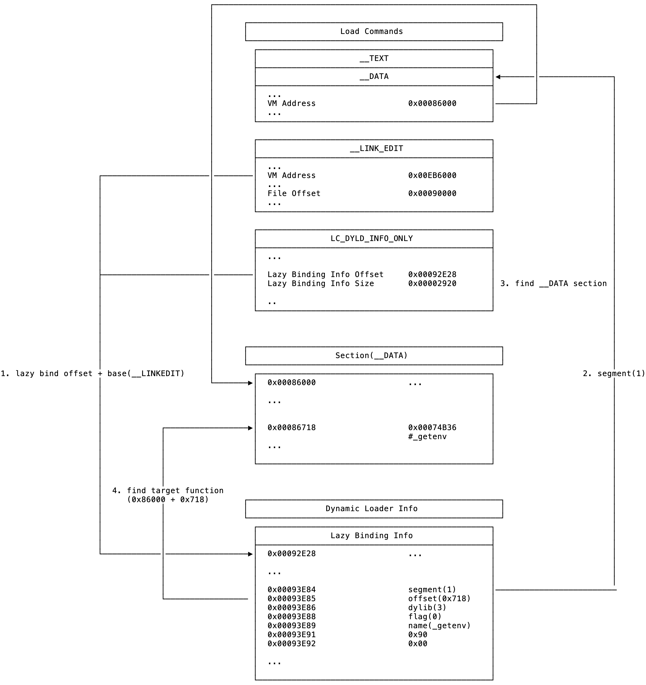

# chook
A new approach to hook C functions by using dyld info.

# Usage
```c
#include "simple_chook.h"

static char* (*ori_getenv)(const char *);

char* my_getenv(const char *s)
{
    printf("🚀 chook bigo!\n");
    return ori_getenv(s);
}

void func(const struct mach_header *header, intptr_t slide)
{
    c_hook(header, slide, "getenv", my_getenv, (void *)&ori_getenv);
}

int main(int argc, char * argv[])
{
    _dyld_register_func_for_add_image(func);

    printf("path = %s\n", getenv("PATH"));
}

// output
// 🚀 chook bigo!
// path = /Applications/Xcode.app/Contents/Developer/Platforms/iPhoneOS.platform/Library/Developer/CoreSimulator/Profiles/Runtimes/iOS.simruntime/Contents/Resources/RuntimeRoot/usr/bin:/Applications/Xcode.app/Contents/Developer/Platforms/iPhoneOS.platform/Library/Developer/CoreSimulator/Profiles/Runtimes/iOS.simruntime/Contents/Resources/RuntimeRoot/bin:/Applications/Xcode.app/Contents/Developer/Platforms/iPhoneOS.platform/Library/Developer/CoreSimulator/Profiles/Runtimes/iOS.simruntime/Contents/Resources/RuntimeRoot/usr/sbin:/Applications/Xcode.app/Contents/Developer/Platforms/iPhoneOS.platform/Library/Developer/CoreSimulator/Profiles/Runtimes/iOS.simruntime/Contents/Resources/RuntimeRoot/sbin:/Applications/Xcode.app/Contents/Developer/Platforms/iPhoneOS.platform/Library/Developer/CoreSimulator/Profiles/Runtimes/iOS.simruntime/Contents/Resources/RuntimeRoot/usr/local/bin
// 🚀 chook bigo!
// ...
```

# How it works


# TODO
- [ ] **(WIP)anti hook C functions**.
- [ ] support more simple function.
- [ ] support hook multiple C functions in one line call.