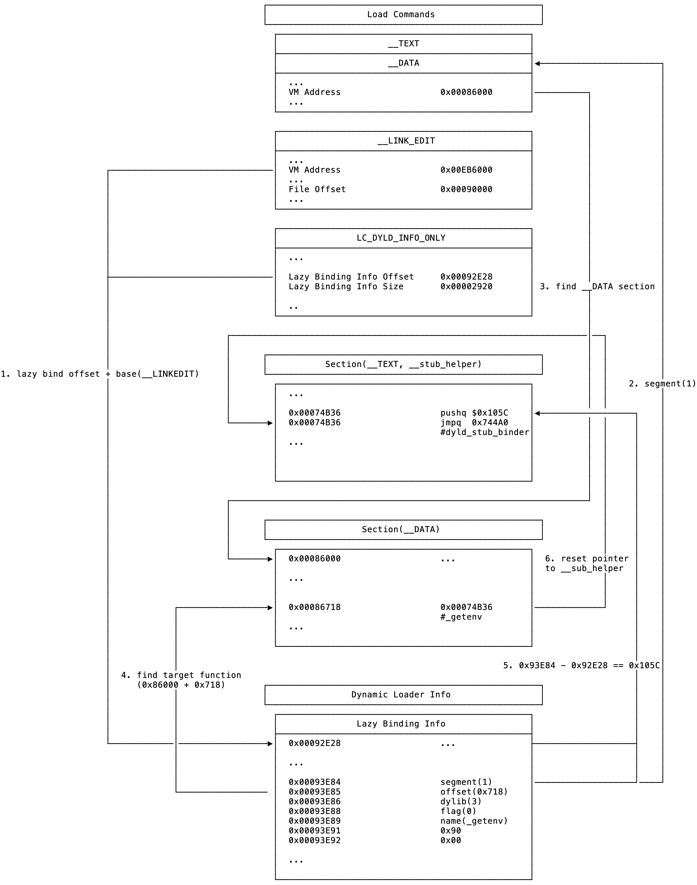

# chook
A new approach to hook C functions in lazy symbol by using dyld info.

# Usage
```c
#include "simple_chook.h"

static char* (*ori_getenv)(const char *);

char* my_getenv(const char *s)
{
    printf("🚀 chook bigo!\n");
    return ori_getenv(s);
}

void c_hook_func(const struct mach_header *header, intptr_t slide)
{
    c_hook(header, slide, "getenv", my_getenv, (void *)&ori_getenv);
}

void reset_c_hook_func(const struct mach_header *header, intptr_t slide)
{
    reset_c_hook(header, slide, "getenv");
}

int main(int argc, char * argv[])
{
    _dyld_register_func_for_add_image(c_hook_func);

    printf("path = %s\n", getenv("PATH"));

    _dyld_register_func_for_add_image(reset_c_hook_func);

    printf("path = %s\n", getenv("PATH"));
}

// output
// 🚀 chook bigo!
// path = path = /usr/bin:/bin:/usr/sbin:/sbin
// path = path = /usr/bin:/bin:/usr/sbin:/sbin
```

# How it works
## hook C functions


## reset hooked C functions


# TODO
- [x] reset hooked C functions.
- [ ] support hook C functions in non-lazy symbol.
- [ ] support more simple function.
- [ ] support hook multiple C functions in one line call.